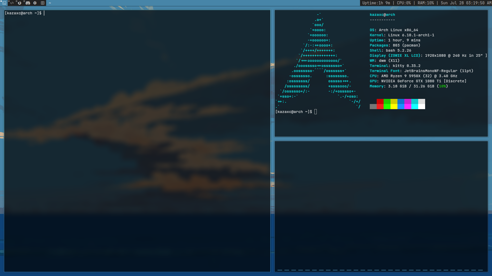

# Dotfiles

Dotfiles for my Arch Linux install and a simple guide on how to use and install them.

**Features:**
  - Terminal - Kitty
  - Shell - Bash
  - Window Manager - DWM
  - System info - Fastfetch
  - Wallpaper Display- Feh
  - Audio Visualiser - Cava

## Guide:
  First you need to edit '.xinitrc' to change xrandr to the settings that best suit your monitor and
  if you wish to use a different wallpaper edit line 2 so that feh loads your desired wallpaper file.
  
  You can also remove line 3 as this changes the keyboard layout to the UK/GB layout or if using anything
  other than US layout change it to the layout you want.
  
  Make sure to copy files prepended with '.' to the user's directory.
  
  The directories 'cava', 'kitty' and 'fastfetch' must be installed to '~.config/' and 'picom.conf'
  in '/etc/xdg/'.
  
  Finally run 'sudo make clean install' in each of the suckless projects 'dmenu', 'dwm',
  'slstatus' and 'st'.

### Credit:
Suckless software: https://suckless.org/

Wallpaper: https://whvn.cc/p97wgp

